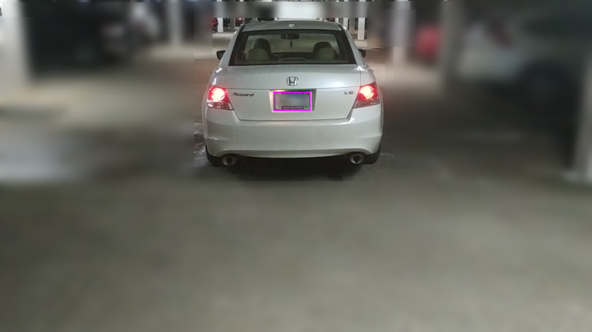
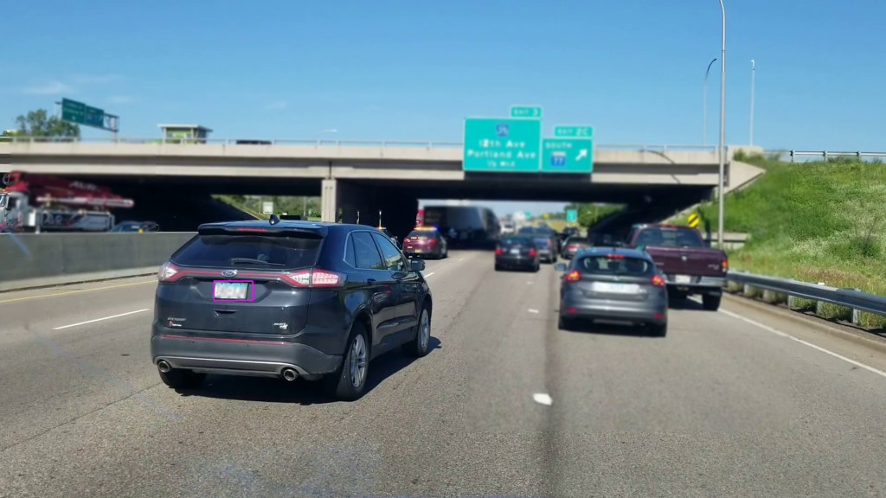

# Warn: This is work in progress
Serving as a Proof of Concept for now.

# Intro
This repository is my first experimentation with [Computer Vision](https://en.wikipedia.org/wiki/Computer_vision).

# Workers
I have created a class which provides the foundation of a `queue`-backed worker processing queued jobs in a separate `thread` - [Worker](../workers/worker.py). Highly configurable, its general idea is - process jobs in its own thread and pass its output as an input of other `worker`s. This allows me to do `object detection`, `ocr`, `rendering` and other concerns in their own threads and at own pace.

Each worker can produce results on multiple `channels`, allowing different results to go to different subscribers. That way workers can be linked together and create a workflow.

# Services
I've split the concerns into separate `worker`-based services:
- [Feed](../workers/feed.py) - collection of classes that provide a 'feed', which is steady stream of frames (images). Classes provide support for Camera, IP Camera and Video file. The result it provides is a 'frame' (image).
- [Classifier](../workers/classifier.py) - A wrapper around `cv2`'s cascade `detectMultiScale` method. It basically allows you to find objects on the image. You'll need to provide a cascade file (see "Training" below). Right now a few sample cascade files are provided, notably [Minnesota License Plates](../classifiers/mn_license_plates.xml), which has been (relatively badly) trained to detect Minnesota license plates. It provides results on two channels - one is the rectangle coordinates around the detected image and the other is a crop (image) of the detected object.
- [Interface](../workers/interface.py) - Provides a simple interface implementation, which just renders a (post-processed) frame on the screen. Does not provide results.
- [OCR](../workers/ocr.py) - A service which attempts to read text out of an image. The result it provides is text (if detected).
- [Plate Lookup](../workers/platelookup.py) - Not implemented, but can be any kind of plate lookup. The result it should provide would be a dictionary of properties.

# Sample Workflow
The services don't necessarily know about each other. Each one has its input and output and is concerned only with its own work load. But when you hook them together in a workflow, they make up an application. So you can implement different applications, by adding new services and configuring the input/output between them.

The 'application' [app_plates.py](../app_plates.py) provides a PoC workflow, which is:

```
 .------rectangle around object coordinates----.
 |                                              \
 \/                                              \
Feed --raw frame--> Classifier --cropped image--> OCR --plate text--> Plate Lookup (TODO)
  \
 (frame could contain
 rectangle around object)
    \
     -processed frame--> Interface --render--> Screen
```

# How to test it out?
If you are not running the script on a portable device such as Raspberry Pi, you can print out a photo of a car with a Minnesota license plate and show it in front of the camera of your computer. It should be able to detect, highlight it and OCR it.

Note that the OCR service is under development and does not provide good results yet.

# Samples
Screen captures of license plates highlighted (pink rectangle) in real time while video feed is streaming. Plates blurred out during writing this documentation, not part of the workflow.

[](images/capture1.png)

[](images/capture2.png)

# Training
For the classifier (object finder) to work properly, you need to train the engine. Further explanation and tutorial is out of scope, but here are some starter resources:
- https://docs.opencv.org/master/dc/d88/tutorial_traincascade.html
- https://amin-ahmadi.com/cascade-trainer-gui (a UI tool that simplifies the process)
- https://kumartechnicalarticles.wordpress.com/2017/03/11/opencv-cascade-training-parameter-tunning

The produced result is a cascade `xml` file which you can use as a parameter for the `Classifier` class.

# Technology used
- [Pillow/PIL](https://github.com/python-pillow/Pillow) - image processing
- [cv2](https://pypi.org/project/opencv-python/) - Computer Vision
- [threading](https://docs.python.org/3.8/library/threading.html) - For doing work in parallel
- [pytesseract](https://pypi.org/project/pytesseract/) - For OCR